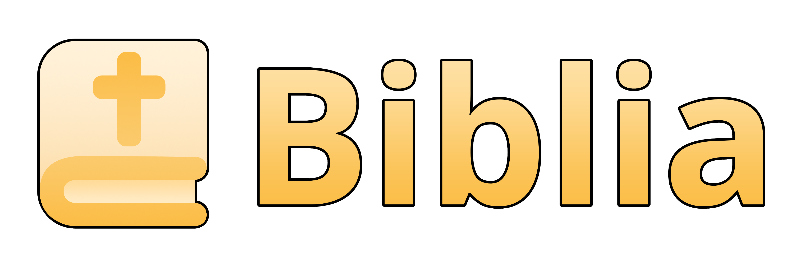

    

# About
**Biblia** is an open-source Discord bot designed for Christians, offering quick and easy access to Scripture through simple commands. Our mission is to make the Bible ravailable wherever you chat on Discord. While Biblia hasn't been officially released yet, you can download the source code and explore it on your own today!

> [!WARNING]
> Biblia is a **work in progress** and is very early in development. Please report any bugs you find.

## Translations
> [!NOTE]
> All translations are cloned from [wldeh's bible-api](https://github.com/wldeh/bible-api)

There are more translations and languages planned, this isn't the final list.

English Translations (10)

- American Standard Version (ASV)
- Berean Study Bible (BSB)
- Duay-Rheims 1899 (DRA)
- Free Bible Version (FBV)
- King James Version (KJV)
- Literal Standard Version (LSV)
- Revised Version 1885 (RV)
- Translation for Translators (T4T)
- World English Bible (American Edition) (WEB)
- World English Bible (British Edition) (WEBBE)

Spanish Translations (4)

- La Biblia en Español Sencillo (BES)
- Palabra de Dios para ti (PDDPT)
- Reina Valera 1909 (RV09)
- Versión Biblia Libre (VBL)

